# Setup Python Environment

For some of the exercises we will use **Visual Studio Code** to to run our python code. 

## 1.1 Open Visual Studio code and clone Git Repo

Open "Visual Studio Code" on your laptop. 
<p>

</p>

Once you opened your Visual Studio Code, you will see the **Welcome** tab. In this Welcome tab select under the **Start** section the option ```Clone Git Repository ``` to clone this Git repository with the exercises using the following URL  
```sh
https://github.com/SAP-samples/teched2025-AI167.git 
```
Paste the URL into the command palette at the top of the window and press enter. 
<p>
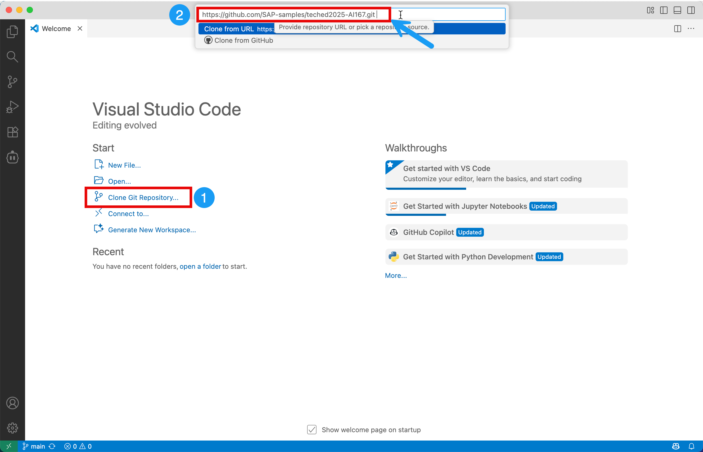
</p>

Select and local directory on your laptop ( e.g. desktop) into which you want to clone the project then select ```Select as Repository Destination ```
<p>
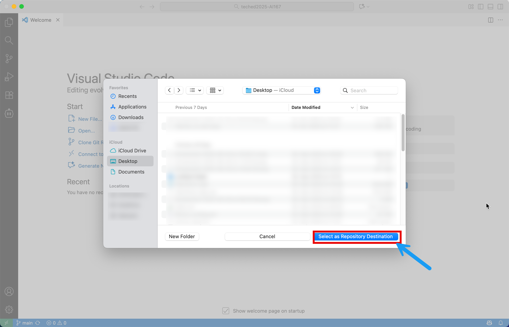
</p>

When you receive the notification asking if you want to open the cloned repository, select ```Open```.
If everything was successful you should see the following folder structure in your Explorer:
<p>
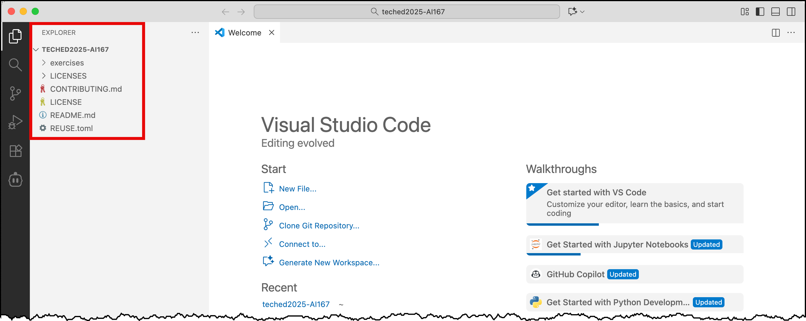
</p>

## 1.2 Configure connection details for AI Core 
For this Hands-on Session we will use the grounding service on AI Core. 
To interact with AI Core, we need to get the service keys and add it to our python environment.
The service keys you will get in the BTP cockpit in the respective service instance, as described in the next steps. 


For the hands-on Session we provided separate [BTP Subaccounts](https://emea.cockpit.btp.cloud.sap/cockpit/?idp=tdct3ched1.accounts.ondemand.com#/globalaccount/4c772782-0751-42ee-93c3-897452fdcb63&//detail/862bffe2-c93b-4314-beef-18ccd09393b3/?layout=TwoColumnsMidExpanded-) for you. 
Please log in with your username and password provided in the workshop room and click on continue.

<p>
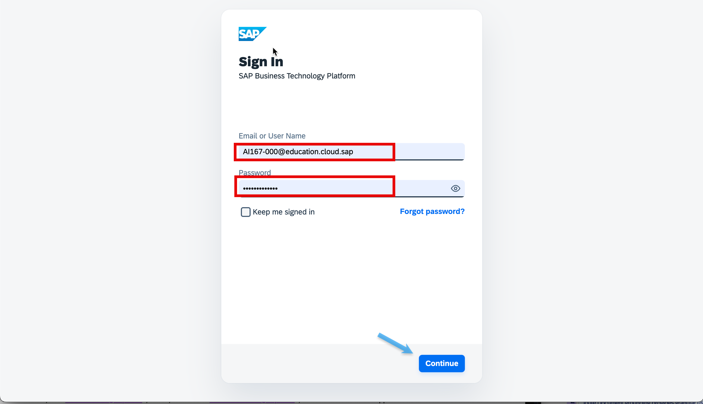
</p>

Once you successfully logged in, you will be redirected to the BTP Cockpit. To see the list of subaccount you need to click on **Account Explorer**.

➡️ Next click on the tile of your respective subaccount **AI167_XXX**.
<p>
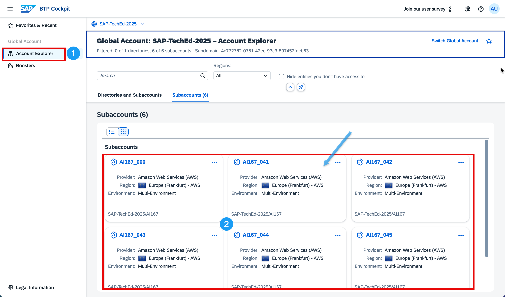
</p>


➡️ Got to  **Instances and Subscription** and open the SAP AI Core Instance's **credentials**. 

<p>
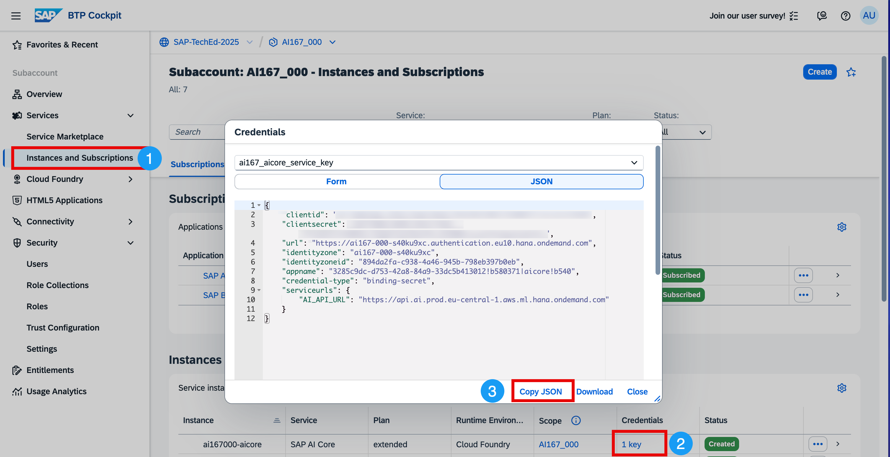
</p>

➡️ Click **Copy Json**

➡️ Return to Visual Studio Code and create a new file ```.aicore-config.json```in the ```TECHED2025-AI167``` directory. 
<p>
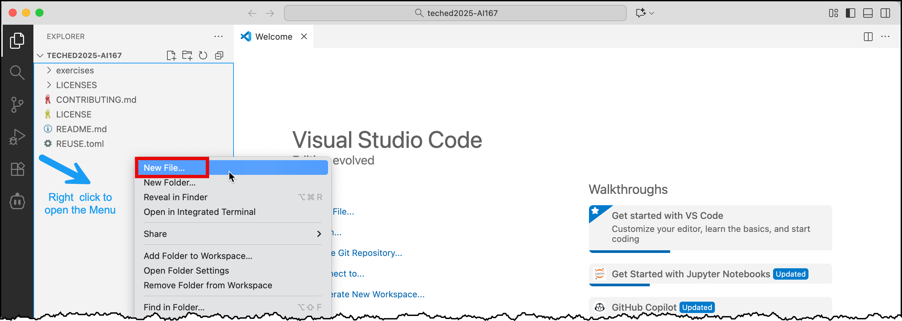
</p>

➡️ Paste in the service key into ```TECHED2025-AI167/.aicore-config.json```, which should look similar to the following.
<p>
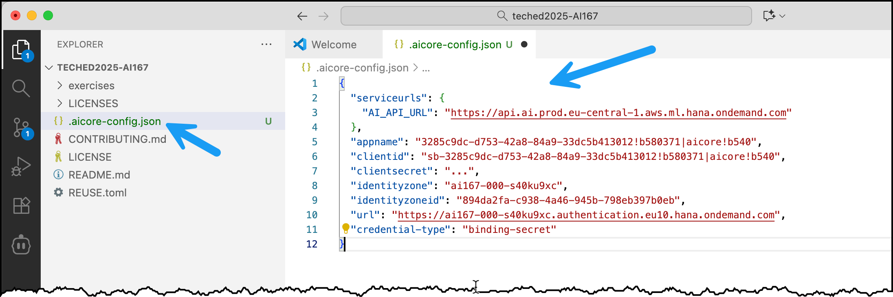
</p>

➡️  Save the file.

## 1.2 Configure connection details Object Store 
Last but not least we have to do the same for the Object Store, that we are going to later in this hands-on session.
The service keys you will get in the BTP cockpit in the respective service instance, as described in the next steps. 


➡️ Navigate back again to  **Instances and Subscription** and open this time the  Object Store instance's service key.

<p>
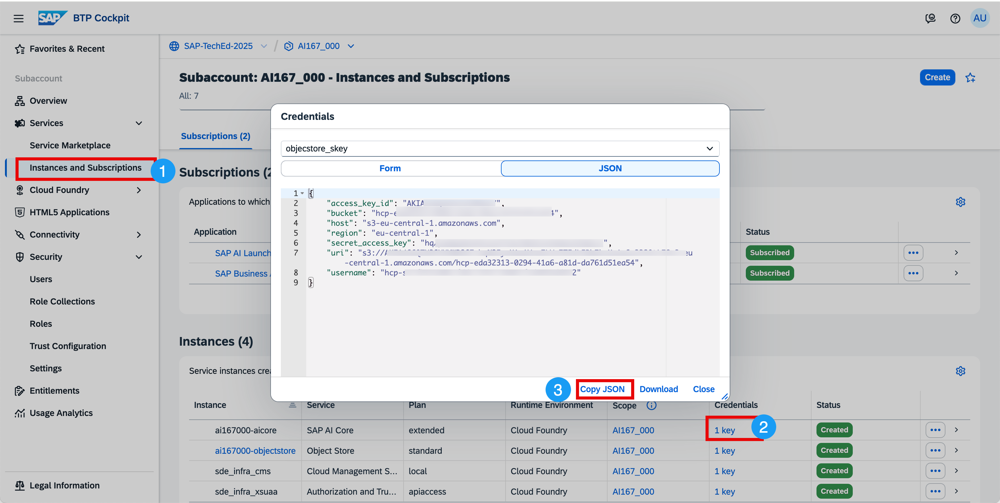
</p>

➡️ Click **Copy Json**

➡️ Return to Visual Studio Code and create a new file ```.objectStore-config.json```in the ```TECHED2025-AI167``` directory.
<p>

</p>

➡️ Paste in the object store service key into ```TECHED2025-AI167/.objectStore-config.json```, which should look similar to the following.
<p>
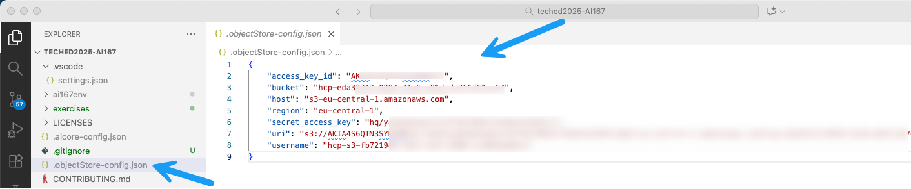
</p>

➡️  Save the file. 


## 1.3 Create a Python virtual environment and install the SAP Cloud SDK for AI

➡️ Start a new Terminal 
<p>
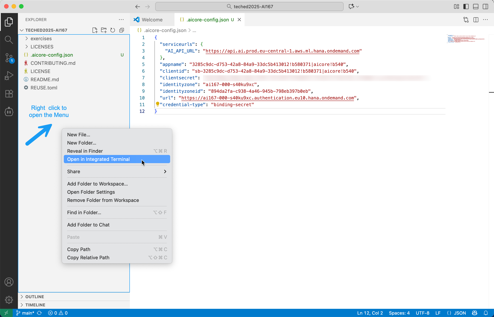
</p>

➡️ In the terminal, enter "python3" to open the Microsoft shop. In the resulting window,
click "Get" to install Python. After a few moments, Python should be installed. 

➡️ Go back to the terminal in VS Code.

➡️ Create a virtual environment using the following command:

```shell
python3 -m venv ai167env --upgrade-deps
```
Activate the virtual environment ```ai167env``` like this and make sure it is activated. 

**If you are attending TechEd in person, follow the instructions for Windows below!**

**On Windows**, run the following command in the terminal:

```powershell
.\ai167env/Scripts/activate
```

Alternatively, on Linux and macOs, or other unix-like systems, run:

```shell
source ai167env/bin/activate
```

⚠️You only need to run one of the commands above, based on your environment.

<p>

</p>
➡️ Install SAP Cloud SDK for AI (Python)

```python
pip install --require-virtualenv -U  "sap-ai-sdk-gen[all]" 
```

This command can take a few moments.

> ✨ **More information**  
> To learn more about SAP CLoud SDK for AI (Python) go [here](https://help.sap.com/doc/generative-ai-hub-sdk/CLOUD/en-US/_reference/README_sphynx.html)  
> All available SAP Cloud SDK for AI you can find [here](https://help.sap.com/docs/sap-ai-core/sap-ai-core-service-guide/libraries-and-sdks)

# For the next Exercise, continue in Visual Studio Code

When running the individual code cells in the next exercise, Visual Studio Code
will ask you to `select a Python environment`. Here, pick the `ai167env` we created earlier.

On a fresh environment, windows may prompt you to  allow network access for Visual Studio Code
Accept this prompt as well.

⚠️  In case Visual Studio Code ask to install ipykernel package - simple click install.
<p>

</p>

Continue to - [Exercise 2 - Get Started with Grounding ](ex2-get-started-with-grounding.ipynb)
