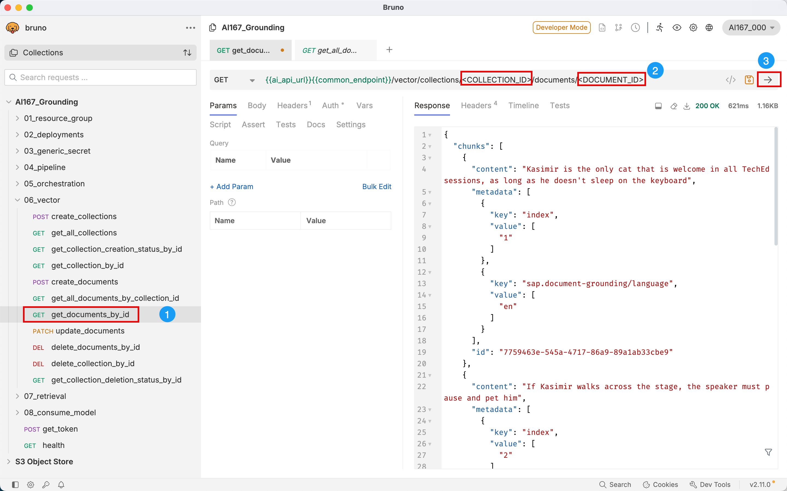

# Excercise 2: Ground your LLM with Custom Documents

Besides grounding your LLM with SAP help you can of course ground your LLM with you own documents. The document file that the grounding service support here are PDF, HTML, TXT, JPEG, JPG, DOCX, PNG, TIFF, PPT.
However to use Grounding you need to prepare a knowlegde base in advance. Generative AI hub provides two otions for the users to provide data (prepare knowledege base):

* Option 1: Provide the chunks of document via Vector API directly
* Option 2: Upload the documents to supported data repository and run the data pipeline to vectorize the documents

In the following you will get to know both option, and we start with option 1

## Excercise 2.1: Provide the chunks of documents via Vector API directly

Vector API is a microservice provided with a Rest API and endpoints for creating and managing collection and documents.


In the following we will do the following steps:
+ Prepare the Vector Knowledge Base
    1. Create Collection
    2. Create documents by directly using the chunks of data provided by users
    3. Store data in the vector database
    4. Assign repository IDs to access the data
* Configure Grounding Module in the Orchestration 
    1. Create a grounding request configuration in the orchestration pipeline using repository IDs
    2.  Run the orchestration pipeline and check that the response refers to the user data

> 🟨 **TODO:**  
> _Add Excercise with Bruno and Vector API_

 >💡 **Note:**  
 >_For this exercise you have to use Bruno_ 

But before we can start using the Vector API you need to generate an access token, which is required for authenticating API requests. Therefore select the _get_token_ request and execute it. 
<br>

### Excercise 2.1.1: Create a collection
To insert your document chunks into a vector store, we first need to create a collection. A collection is a logical container used to store and manage embedded documents. 
Therefore you expand in the _AI167_Grounding_ collection _06_vector_ and click and select ```POST create_collections``` (Step 1).

<p>

</p>

Replace (Step 2) collecion name ```<TITLE>``` by _Kasimir_ and ```<VALUE>``` in ```metadata.purpose by _"Kasimirs TechEd Cat Policy"_. 
Addidionally to that the embedding model will be defined to be used during the vectorization. Currently only supported model is _text-embedding-3-large_.

The payload should look like the following.
<p>

</p>
Once you successfully replaced the values execute the POST request (Step 3). If all went well you should reveive the return code 202. 

Next we need to get the _collection id_. Therefore select ```GET get_all_collections``` and execute the request. Copy the collection id from the result. 

<p>

</p>


### Excercise 2.1.2: Create chunks of documents
After successfully created the collection we can now upload the document chunks to the collection, that we are going to use for our grounding.
The Chunks we are using are Kasimir's TechEd Policies: 
```
1. "Kasimir is the only cat that is welcome in all TechEd sessions, as long as he doesn't sleep on the keyboard"
2. "If Kasimir walks across the stage, the speaker must pause and pet him"
3. "Kasimir insists that every prompt engineering at TecheEd starts with the phrase 'Dear Cat Overlord' "
4. "Kasimir is the only one allowed to wear a hoodie that says '#1 AI Expert'"
```
To create the chunks of document sokease selet ```POST create_documents```. The body 


* you can define a metadata key value pair for the overall document collection
* define multiple text content in chunks where each of them also have the option metadata key value pair
* Replace value of the content of each chunk with the 4 chunks of Kasimirs Teched policy
* Run the request
* Copy the id 

There are also severel API Request, that help to inspect the vector collections  and documents to confirm successful processing. 

Let is run one of them, to check whether the chunks where succesfully created. Therefore select ```GET get_documents_by_id ```. 
Replace in the request the ```<COLLECTION_ID>```and ```<DOCUMENT_ID>```by your ID, that you got from the previews steps. Run the request. 


Response include all the chunks for the document collection. Additionally you can also see that each chunks consist of an id as well information about the language of each chunk. 


### Excercise 2.1.3: Retrieval
We now successfully prepared the data repository for grounding, by using the Vetctor API. Now in this Excerise we want to retrieve the data by running a query. 
But first let us check the list of data repository that we have. 


* what is the repo
* type vector
* also see the sap help
* copy the id --> id of the document colletion 


Questions:
"How do I start a prompt?"
"What happens if Kasimir walks on stage during a talk?"
"Who is allowed to wear a '#1 AI Expert' hoodie?"
"Are cats allowed in TechEd Sessions? "

## Summary

For the next excercise you will go back to Visual Code.

Continue to - [Exercise 2.2: Run data pipeline to vectorize documents](ex2-2-grounding-custom-documents.ipynb)
