# Exercise 3: Ground your LLM with Custom Documents

Besides grounding your LLM with SAP help you can of course ground your LLM with you own documents. The document file that the grounding service support here are PDF, HTML, TXT, JPEG, JPG, DOCX, PNG, TIFF, PPT.
However to use Grounding you need to prepare a knowledge base in advance.

Let us use the following example to deep dive into it:

You may already met in the last days our TechEd Mascot, **Kasimir the Cat**. Since there might be _lots_ of incoming question about Kasimir and his own TechEd rules, let's help our LLM to get its fact straight!  

In the next two exercises, we'll build a knowledge base that our LLM can use for grounding. 
Generative AI hub provides two ways to prepare and load these knowledge bases:
* **Option 1**: Provide the chunks of document via **Vector API** directly ([Exercise 3.1](#exercise-31-provide-the-chunks-of-document-via-vector-api-directly))
* **Option 2**: Upload the documents to supported data repository (S3) and run a data pipeline to vectorize it ( [Exercise 3.2](ex32-grounding-data-pipeline.ipynb))

We'll start in with Option 1 and later look at Option 2 in Exercise 3.2, so by the end you'll know how to ground Kasimir's Policies -- or any other documents -- using both of the approaches. 

# Exercise 3.1: Provide the chunks of document via Vector API directly
## Setup Bruno Environment

To use the Vector API we need to the API client Bruno. 

➡️ Open **Bruno** on your laptop ( it is the icon with the cute little dog)

<p>

</p>

Once you opened your **Bruno**, you will see the **Welcome** page. 

➡️ On this page select ```Import Collection```. 

<p>
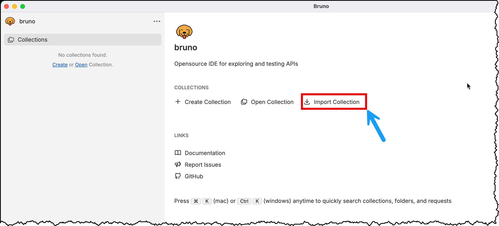
</p>

➡️ click on **"choose file(s)"**
<p>
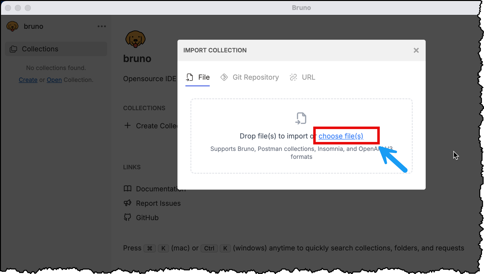
</p>

The Bruno collection you find under ```TECHED2025-AI167/exercise/bruno_collection/AI167_Grounding.json```. ( The location of the folder ```TECHED2025-AI167``` is the one you chose in Exercise 1 while cloning the github repos )

If you stored the GitHub repository in your home directory on windows, navigate to `Local Disk (C:) -> Users -> $USER -> teched2025-AI167`.

➡️ Navigate to the ```TECHED2025-AI167/exercise/bruno_collection```and select both collection in this folder:  ```AI167_Grounding.json```and ```S3_FileUpload.json``` (second one we need in [Exercise 3.2](exercise/ex3-2-upload-file-s3.md)) and select **Open**.
<p>
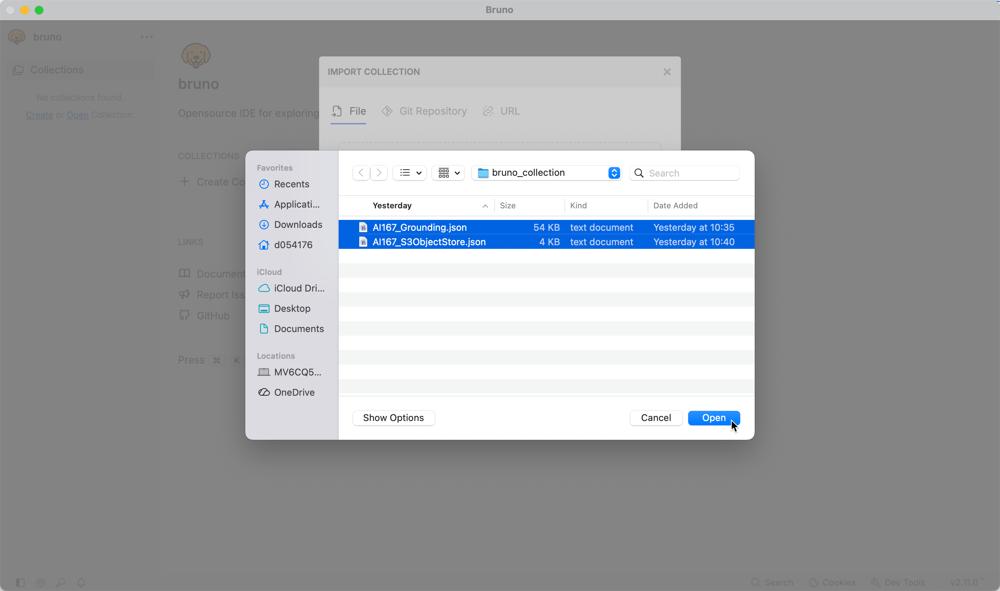
</p>

⚠️ On older versions of Bruno, you will only be able to select a single file. In this case, import both files
separately!

➡️ Choose a location (use simple the same location) and select **Import**
<p>
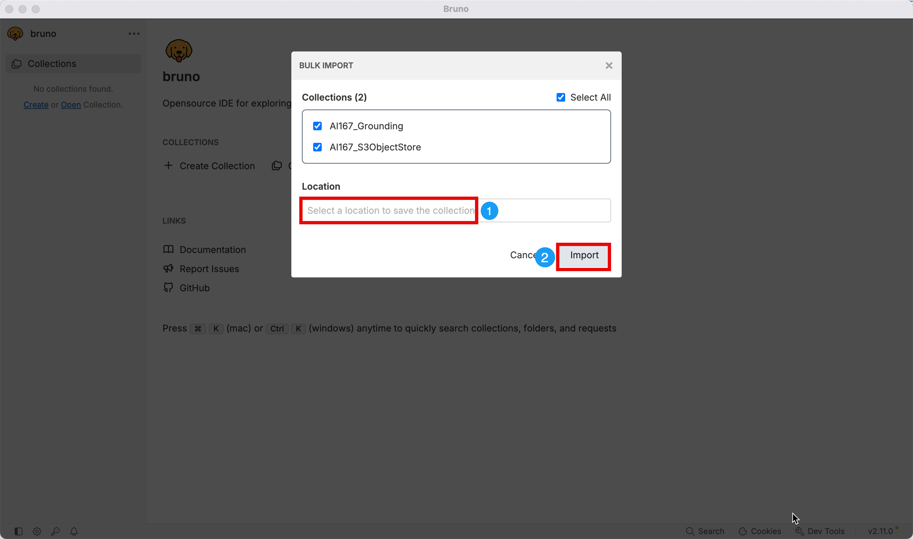
</p>

We are almost there. As the final step we need to set the environment variables to establish the connection to AI Core. 

➡️ Click on ```AI167_Grounding```to expand the folder (1).  
➡️ Click at top right corner on ```No Environments``` (2)   
➡️ Select ```Configure``` to start setting the environment variables. 
<p>
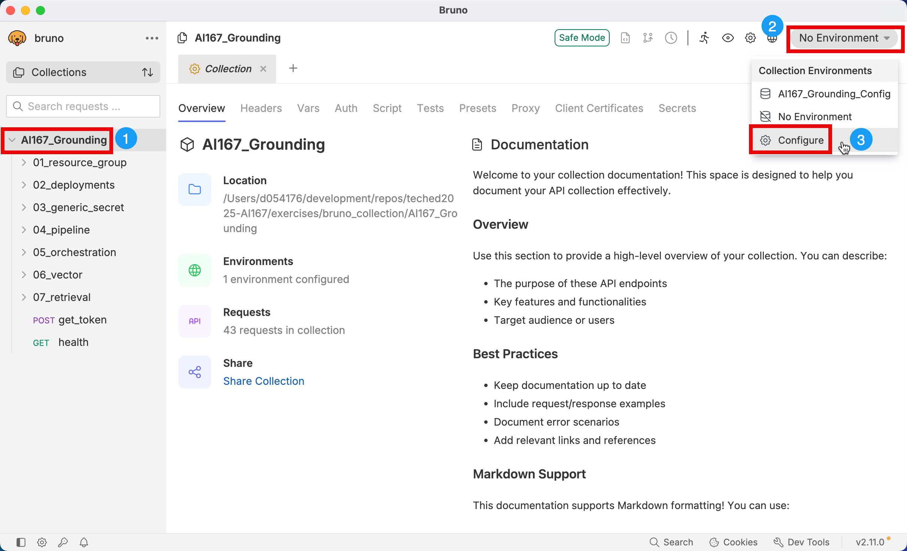
</p>

➡️ Take values from  ```TECHED2025-AI167/.aicore-config.json``` and populate them into the variables. 

Use the following mapping add the correct Name-Value pair:

| Bruno Env Variables | .aicore-config.json |
|------|-------------|
| ai_auth_url | url |
| ai_api_url| AI_API_URL|
| client_id | clientid|
| client_secret | clientid|
<p>
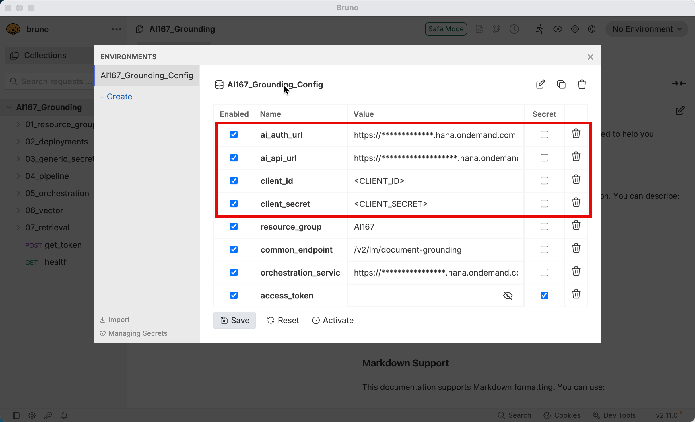
</p>

➡️ After you added the values, select **Save** and then **Activate**

<p>
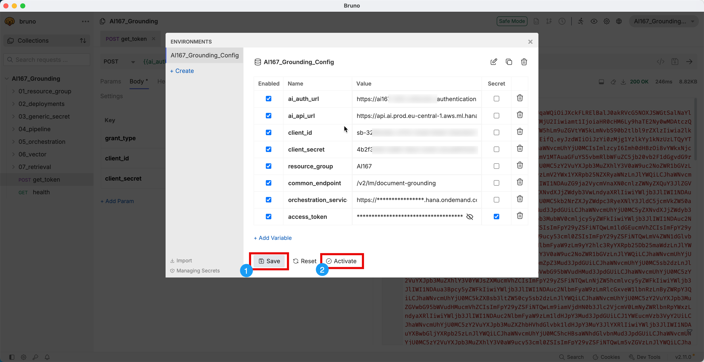
</p>


🎉 Congratulations you survived another environment set up. Now let the fun part begin! 🎉


## Provide the chunks of documents via Vector API directly

Vector API is a microservice provided with a Rest API and endpoints for creating and managing collection and documents.

In the following we will do the following steps:
+ Prepare the Vector Knowledge Base
    1. Create Collection
    2. Create documents by directly using the chunks of data provided by users
    3. Store data in the vector database
    4. Assign repository IDs to access the data
* Configure Grounding Module in the Orchestration 
    1. Create a grounding request configuration in the orchestration pipeline using repository IDs
    2.  Run the orchestration pipeline and check that the response refers to the user data

### Generate Access Token
First we need to generate an access token, that is required for authenticating API requests.  

➡️ Select the **get_token** request and execute it. 

<br>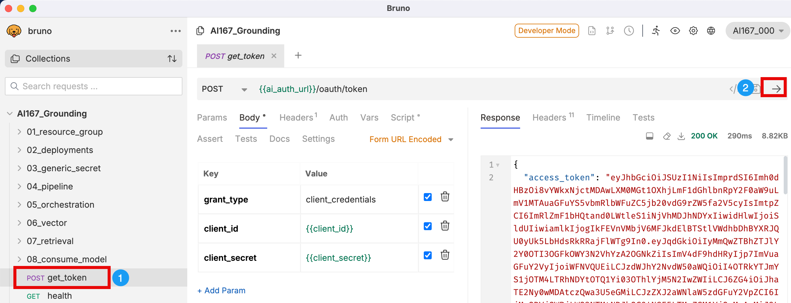

### Create a collection
To insert your document chunks into the SAP HANA vector store, we first need to create a collection. A collection is a logical container used to store and manage embedded documents.  

➡️ Expand **_06_vector_** and select ```POST create_collections```.

➡️ Replace collection name ```<TITLE>``` by **"Kasimir"** and ```<VALUE>``` in _metadata.value_ by **"Kasimirs TechEd Cat Policy"**.  

The embedding model is already defined, that is used during the vectorization. Currently only supported model is _text-embedding-3-large_.

<p>
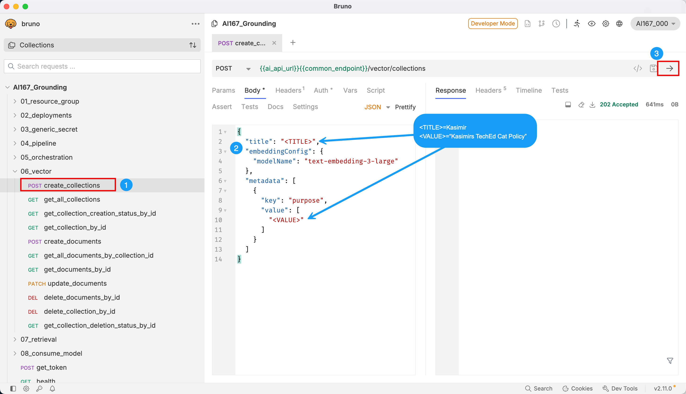
</p>

Your payload should look like the following:

<p>
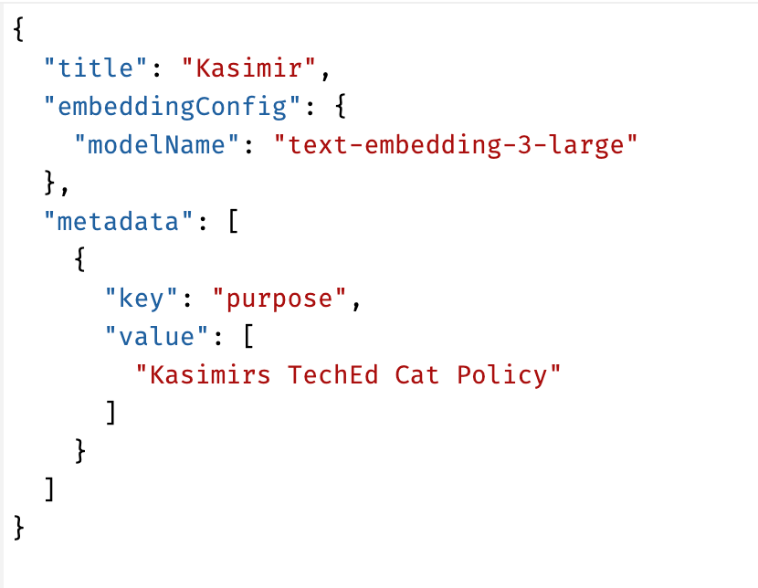
</p>

➡️ Execute the POST request (3). If all went well you should receive the return code 202 with an empty response body.

### Get Collection ID

Next we need to get the **collection id** that we need for creating the chunks.  

➡️ Select ```GET get_all_collections``` and run the request and **copy the collection id** from the result. 

<p>
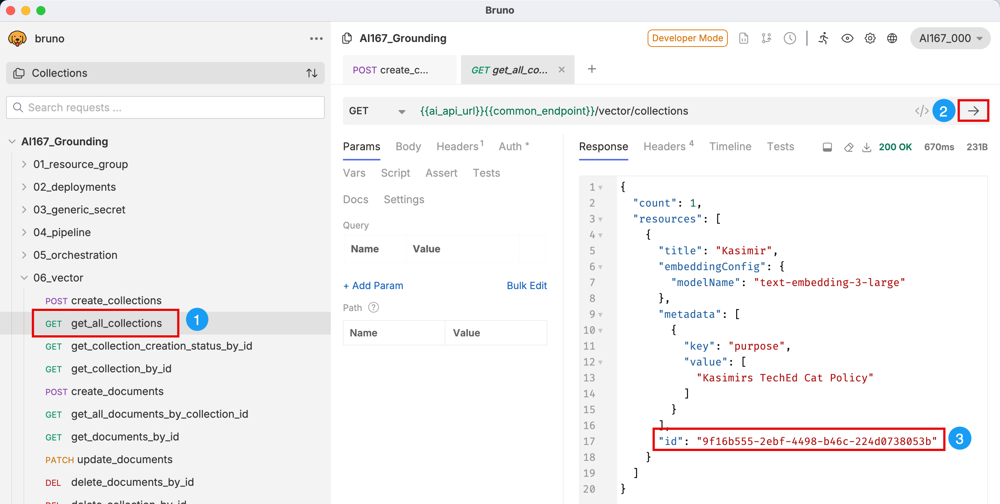
</p>


### Create chunks of documents
After successfully created the collection we can now upload the document chunks to the collection, that we are going to use for our grounding.

➡️  Select ```POST create_documents```  

<p>
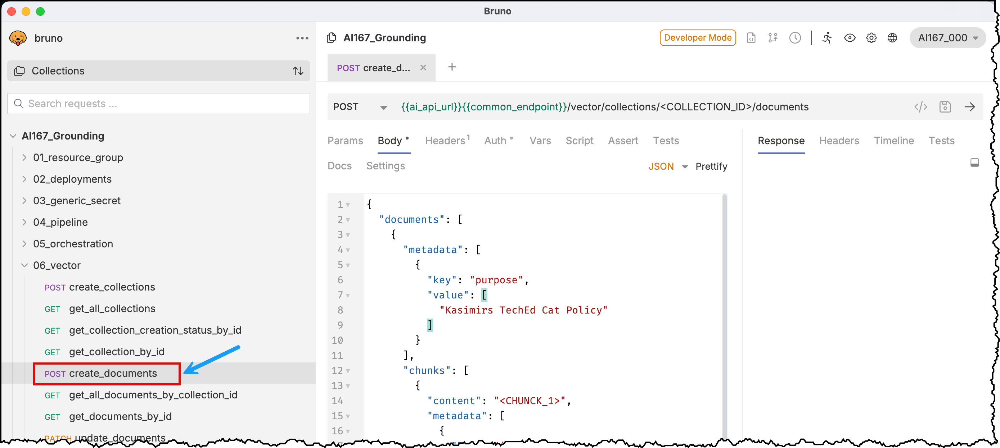
</p>

➡️ Replace the ```<COLLECTION_ID>``` in the URL and run the request. 

<p>
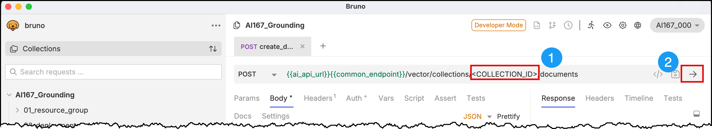
</p>

In this **POST** request you can define a metadata key value pair for the overall document collection and create multiple text content in chunks where each of them also have the option of metadata key value pairs. 

We are going to add the following 4 chunks: 
```
Kasimir's TechEd Policies: 

1. "Kasimir is the only cat that is welcome in all TechEd sessions, as long as he doesn't sleep on the keyboard"
2. "If Kasimir walks across the stage, the speaker must pause and pet him"
3. "Kasimir insists that every prompt engineering at TechEd starts with the phrase 'Dear Cat Overlord' "
4. "The only dog that Kasimir accepts at TechED is Bruno!'"
```

➡️ Replace each of the placeholder **<CHUNK_1>** to **<CHUNK_4>** with **Kasimirs TechEd Policy** sentences. 

<p>
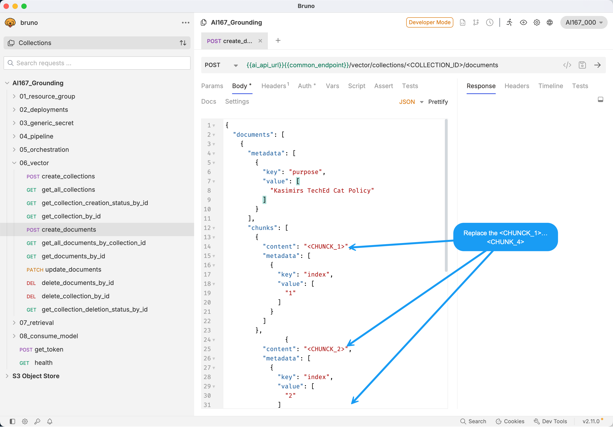
</p>

Your body should look like the following:

<div style="max-height:500px; overflow-y:auto; border:1px solid #ccc; padding:8px;">
<pre><code class="language-json">
{
  "documents": [
    {
      "metadata": [
        {
          "key": "purpose",
          "value": [
            "Kasimirs TechEd Cat Policy"
          ]
        }
      ],
      "chunks": [
        {
          "content": "Kasimir is the only cat that is welcome in all TechEd sessions, as long as he doesn't sleep on the keyboard",
          "metadata": [
            {
              "key": "index",
              "value": [
                "1"
              ]
            }
          ]
        },
                {
          "content": "If Kasimir walks across the stage, the speaker must pause and pet him",
          "metadata": [
            {
              "key": "index",
              "value": [
                "2"
              ]
            }
          ]
        },
                {
          "content":"Kasimir insists that every prompt engineering at TechEd starts with the phrase 'Dear Cat Overlord' ",
          "metadata": [
            {
              "key": "index",
              "value": [
                "3"
              ]
            }
          ]
        },
                {
          "content": "The only dog that Kasimir accepts at TechED is Bruno!",
          "metadata": [
            {
              "key": "index",
              "value": [
                "4"
              ]
            }
          ]
        }
      ]
    }
  ]
}
</code></pre>
</div>

After successful execution response got returned with the **document ID**

➡️ Copy the document ID.

<p>
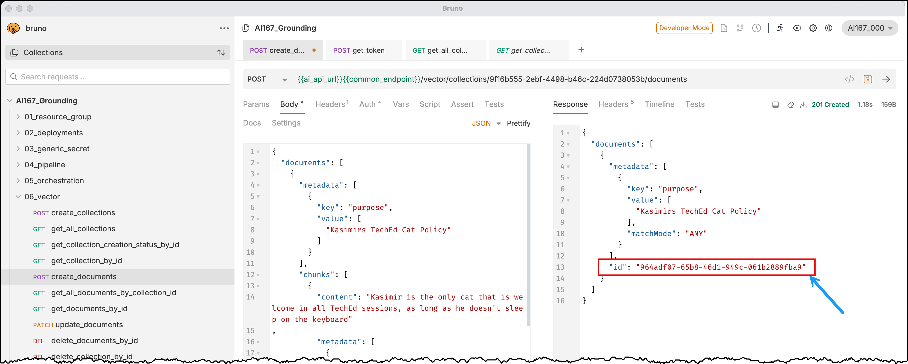
</p>


### Inspect the vector collection

There are several API Request, that help to inspect the vector collections and documents to confirm successful processing. 

Let is run one of them, to check whether the chunks were successfully created. 

➡️ Select ```GET get_documents_by_id ```(1).  
➡️ Replace in the request the ```<COLLECTION_ID>```and ```<DOCUMENT_ID>``` by the IDs that you got from the previews steps (2).  
➡️ Run the request (3).  

<p>
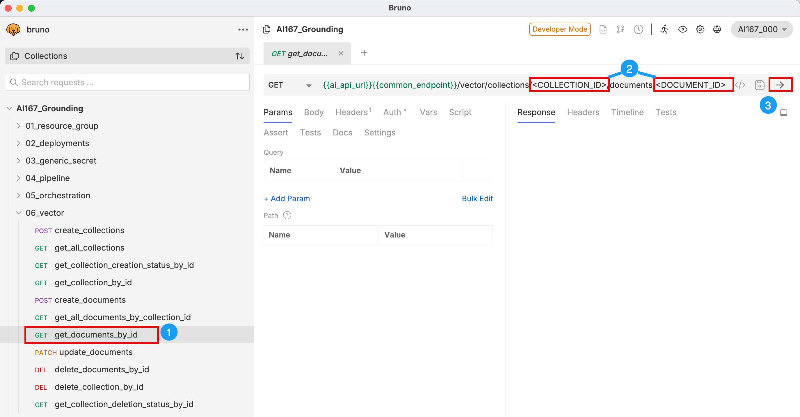
</p>

Response includes all the chunks for the document collection. Additionally, you can also see that each chunks consist of an id as well information about the language of each chunk. 

<p>
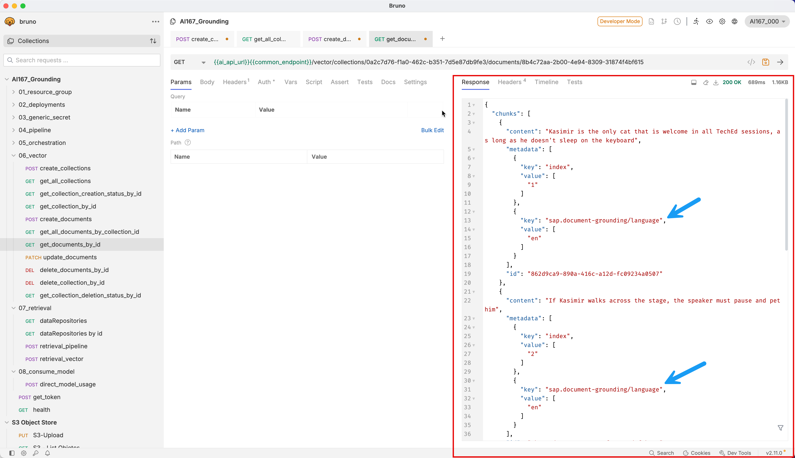
</p>

### Overview of all data repositories

Next we will use the [Retrieval API](https://api.sap.com/api/DOCUMENT_GROUNDING_API/resource/Retrieval).
The **Retrieval API** lets you retrieve repositories or collections created through the Vector API. 

Let us get an overview on all repositories that are available.

➡️ Expand **07_retrieval** and select ```GET dataRepositories``` (1).  
➡️ Run the request (2).  
<p>
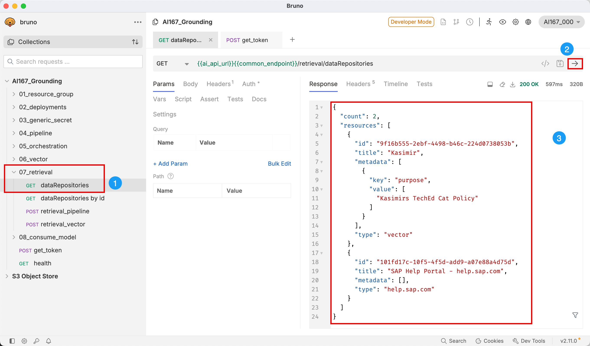
</p>

 The response includes an array of all available data repository objects. 
 The value of key ```type``` tells what kind of data repository it is:  
- type: "vector" → your custom vector collection (embeddings you created).
- type: "help.sap.com" → built‑in SAP Help Portal ([Exercise 1](ex2-get-started-with-grounding.ipynb))
➡️ Copy the ```id``` of you data repository. 

### Retrieval
Next let us do the data retrieval to retrieve a content based answer, by using our data repository. 

➡️ select ```POST retrieval```
<p>

</p>

In the body of the retrieval search you can define several retrieval constraints. Most of them are optional and can be empty. The one that are relevant for our exercise are:
- ```query``` that will be embedded and match against the stored chunks
- ```dataRepositoryType``` to define the kind of data repository, in our case **vector**
- ```dataRepositories"``to list the data repositories you want to use
- ```maxChunkCount```: maximum number of chunks to be returned


➡️ Next replace in the Body ```<QUERY>```  by ``` "Are cats allowed at TechEd?" ```  
➡️ Add in the data repository id to ``` dataRepositories" ``` array.  
➡️ Run the request. 

<p>
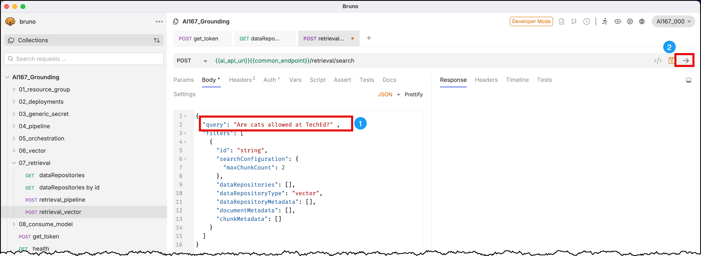
</p>

The response includes now the two relevant chunks identified using the similarity search on the HANA vector Store.

For each chunk the response also returns the ```searchScores``` that includes:
- ```aggregatedScore```: Final score after combining multiple ranking methods. Today, only dense retrieval is supported,
  hence this is the same as `denseRetrievalScore`.
- ```denseRetrievalScore```: Similarity between the query embedding and the chunk embedding (Higher = more semantically relevant).   

The scores can be used on the client to apply a similarity threshold.

🎉 Congratulations you successfully created you first data repository and run your first retrieval search. 🎉

If you want more you can also try out the following queries and also change number of ```maxChunkCount```.
```
Questions:

"How do I start a prompt?"
"What happens if Kasimir walks on stage during a talk?"
"Are dogs allowed at TechEd?"
```
## Summary

In this exercise you got to know one of the option that Generative AI Hub provides to prepare a data repository.
You used the Vector API to provide the chunks of document directly and used the Retrieval API to run a similarity search on the HANA vector store. 
 
In our next Exercise you well get to know the other option of preparing a data repository by upload the documents to s3 bucket and run the data pipeline to vectorize the documents. 

Continue to - [Exercise 3.2: Upload File to S3](ex3-2-upload-file-s3.md)
