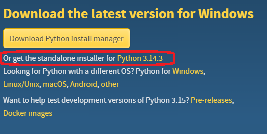

# Pre-Requisites Installation

To do this exercises, you'll need the following:
- Visual Code Studio
- Python
- Bruno

## 1.1 Install Visual Studio

To install **Visual Studio Code** access the [VS Code homepage](https://code.visualstudio.com/) and download it.

Run the installation file and follow the Wizard.

## 1.2 Install Python 3

To install **Python** access the [Python download page](https://www.python.org/downloads/) and download the latest version.

You can download the standalone installer.

## 1.3 Install Bruno

To install **Bruno** access the [Bruno homepage](https://www.usebruno.com/) and download it.

Run the installation file and follow the Wizard.

